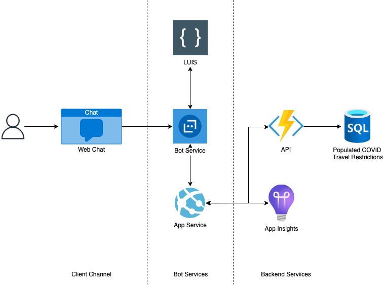

# COVID Travel Bot

## Objective

I wanted to create a chatbot that gives useful information for traveling in this new era of COVID. The chatbot provides what travel restrictions are in place for a country the user might want to visit.

### Example interaction:

User: Can I go to India?\
Bot: What country are you flying from?\
User: USA\
Bot: You're a citizen of?\
User: I'm American\
Bot: Do you plan to travel for work or fun?\
User: Fun!\
Bot: Here are the latest CDC guidelines: <-link-to-guidelines->. You cannot currently travel to India as a tourist.

## Technology

- Azure Bot Service (Bot Framework Composer + Bot Framework Emulator) with LUIS
- DotNet Framework
- Azure Functions + SQL DB for the backend

## Current State of the Project

- I have successfully implemented the LUIS rules & bot validation
- Created a SQL DB, and started working on connecting it to the DB

## Help this Project Can Use

- A script to populate the database with guidelines from around the world
- Connecting the DB & Bot

## Extension of the Project

- A UI for the users to interact with the bot

## My Findings & Things I Tried

- **Node (in preview) with Webapp or Azure Functions do not work out of the box, you will need to add an index page,** when creating a bot with the Bot Framework Composer: I tried creating completely new projects with Node & Azure Webapp, and then one with Node & Azure Functions. Neither of the projects deployed out of the box & threw a 500 error (request timed out). So I chose to work with DotNet & Functions, which worked. On further investigation, I found that you need to add an index page to your project for the Node version of the bot to work. More information on this is in this [GitHub issue](https://github.com/microsoft/BotFramework-Composer/issues/8720#issuecomment-940504004).
- **Create the authoring & publishing profile for LUIS FIRST, then hook up the LUIS resources to the bot**: There is a lack of documentation on this. I had a LUIS resource created before the chatbot, and wanted to hook that up to my bot. Unfortunately, this is harder than you think._The better way to go about this was to create the bot first, then the authoring & predicting resources through the composer (so that it's in the same resource group as the bot composer's created resources), and THEN you can hook up the LUIS resource to the bot._
- **Create the Bot, then work on LUIS WITHIN the bot composer instead of LUIS portal**: The bot composer creates a new LUIS resource automatically for your project, which is overwritten everytime you deploy from the bot composer. So I learnt that adding LUIS rules within the bot composer is the better way to train the LUIS instance.
- **Counterintuitive Validation Rules Section**: I wanted to make sure I check if the location detected by my bot is in fact a location value. So I wanted to check that the detected location is the same as the expected location. It was hard to go and find how to do this action. To achieve the validation, I had to go to the 'Other' tab within the 'Prompt for text' component and add a validation rule under 'Validation'. This is counterintuitive. I was expecting a condition expression field within the component.
